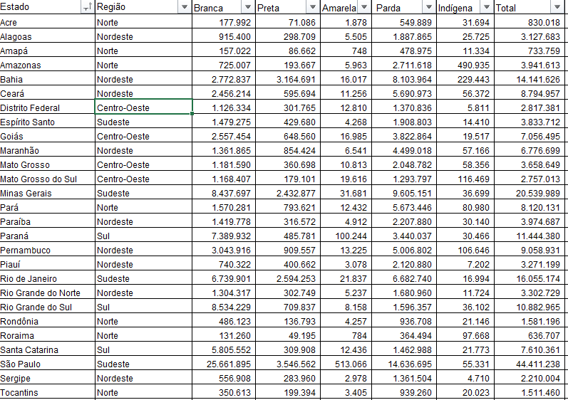

<h1>Bem vindo ao nosso projeto do Hackaton</h1>

<h2>Sumário</h2>
        <ul>
            <li><a href="#tratamento">Tratamento Corpo Solution</a>
                <ul>
                    <li><a href="#etl">Extração, Transformação e Carregamento(ETL) dos Dados</a>
                        <ul>
                            <li><a href="#dsbasededados">Base de Dados</a></li>
                            <li><a href="#dsstateofdata">State of Data</a></li>
                            <li><a href="#dsibge">IBGE</a></li>
                        </ul>
                    </li>
                    <li><a href="#dependencias">Dependências necessárias</a>
                        <ul>
                            <li><a href="#passoapasso">Passo a Passo</a></li>
                            <li><a href="#bancodedados">Banco de Dados</a></li>
                        </ul>
                    </li>
                </ul>
            </li>
        </ul>
 
 
<h2 id="etl">Extração, Transformação e Carregamento(ETL) dos Dados</h1>
O processo de ETL é fundamental na gestão e análise de dados. Ele compreende três etapas principais:

1. <b>Extração</b>: Nesta etapa, os dados são coletados de suas fontes de origem, que podem incluir bancos de dados, arquivos, APIs ou outras fontes de dados. A extração envolve acessar e capturar os dados brutos de suas fontes e transferi-los para um ambiente de armazenamento centralizado.

2. <b>Transformação</b>: Após a extração, os dados brutos passam por processos de transformação para prepará-los para análise. Isso pode incluir limpeza de dados, padronização de formatos, remoção de duplicatas, correção de erros e agregação de informações. A transformação visa garantir que os dados estejam consistentes, precisos e prontos para serem utilizados nas análises.

3. <b>Carregamento</b>: Por fim, os dados transformados são carregados em um destino final, como um data warehouse, um banco de dados ou uma ferramenta de análise. Nesta etapa, os dados são organizados e estruturados de forma adequada para facilitar o acesso e a consulta posterior. O carregamento pode ser realizado de forma incremental, adicionando novos dados aos já existentes, ou de forma completa, substituindo os dados antigos pelos novos.

O processo de ETL é essencial para garantir a qualidade e a integridade dos dados, preparando-os para serem utilizados em análises e tomadas de decisão. Ele proporciona uma base sólida para a realização de análises de dados eficazes e ajuda a garantir que as informações obtidas sejam confiáveis e relevantes para os objetivos do negócio.

<h3 id="dsbasededados"> Base de Dados</h3>

O primeiro conjunto de dados que utilizaremos no projeto são os dados dos funcionários da Corp Solutions, denominado base_dados.csv. Essa base de dados possui um total de 10.000 registros distribuídos em 12 colunas (id, id, Nome, Genero, Idade, Raça, Endereço, Formação, Estado, Tempo de casa, Departamento, Senioridade). Segue abaixo os 5 primeiros registos do daseset.

|id|id.1|Nome|Genero|Idade|Raça|Endereço|Formação|Estado|Tempo de casa|Departamento|Senioridade|
|---|---|---|---|---|---|---|---|---|---|---|---|
|0|1|1|Eleonora Arilda Penedo Gomes de Padilha|Fem|34.0|pardo|9155 Harold Oval\nSellersside, FL 21337|Ensino Médio|Santa Catarina|12.0|Compras|Analista Pleno|
|1|2|2|Elisângela Gabrielle de Osório|Fem|26.0|pardo|941 Martin Manor\nLake Isaiahtown, FM 43797|Ensino Médio|Pará|6.0|Contabilidade|Analista Júnior|
|2|3|3|José Túlio de Cabral|Masc|35.0|pardo|110 Davis Ridges\nMejiaville, LA 17095|Ensino Médio|Santa Catarina|5.0|Vendas|Analista Pleno|
|3|4|4|Ezequiel Edivaldo de Medeiros Sonao|Masc|24.0|pardo|48010 Wilson Glen Apt. 749\nSmithborough, NV 0...|Ensino Superior|Tocantins|4.0|Administrativo|Gerente|
|4|5|5|Fagner Josiel dos Santos|Masc|21.0|pardo|8666 Ramos Ports Apt. 070\nSandraport, MN 33570|Ensino Superior|Ceará|5.0|Recursos Humanos|Analista Júnior|

O primeiro passo foi importar a Biblioteca `Pandas` dentro do Python para fazer toda a manipulação dos dados.

```python
import pandas as pd
```

O segundo passo é ler o arquivo usando a função built in do Pandas *read_csv*.

```python
df = pd.read_csv('Data_Base/base_dados_encoding.csv')
```

Como pode ser notado na planilha supracitada, a codificação padrão do arquivo está diferente do padrão de codificação do Brasil, que é o UTF-8. Porém, ao ser carregado, o Python converteu os dados para o nosso padrão de forma automática.

Utilizando o Pandas, iniciamos o tratamento dos dados por identificar se o dataset possui valores duplicados e valores nulos utilizando as funções duplicated e info. Não foram encontrados valores duplicados, porém identificamos que na coluna Idade faltam 56 registros, na coluna formação faltam 44 registros e, por fim, na coluna Tempo de casa faltam 200 registros, totalizando 300 registros, o que representa 4% de toda nossa base de dados.

```python
df.info()
```

```bash
<class 'pandas.core.frame.DataFrame'>
RangeIndex: 10000 entries, 0 to 9999
Data columns (total 12 columns):
 #   Column         Non-Null Count  Dtype  
---  ------         --------------  -----  
 0   id             10000 non-null  int64  
 1   id.1           10000 non-null  int64  
 2   Nome           10000 non-null  object 
 3   Genero         10000 non-null  object 
 4   Idade          9944 non-null   float64
 5   Raça           10000 non-null  object 
 6   Endereço       10000 non-null  object 
 7   Formação       9956 non-null   object 
 8   Estado         10000 non-null  object 
 9   Tempo de casa  9800 non-null   float64
 10  Departamento   10000 non-null  object 
 11  Senioridade    10000 non-null  object 
dtypes: float64(2), int64(2), object(8)
memory usage: 937.6+ KB
```

O próximo passo foi identificar outliers em cada uma das colunas. Para isso, usamos a função *unique* do Pandas que retorna todos os dados únicos. Foram identificados outliers na tabela Idade onde haviam 23 registros de pessoas com menos de 14 anos, e na Tabela Tempo de casa foram identificados 98 valores negativos. Fizemos a remoção desses registros para evitar o comprometimento de nossa análise.

```python
df_filtrado = df.drop(df[df['Idade'] < 14].index)

df_filtrado2 = df_filtrado.drop(df_filtrado[df_filtrado['Tempo de casa'] < 0].index)
```

Foi feita uma analise nos funcionários com idade entre 14 e 18 anos para identificar quais deles tinha a senioridade de estagiário. Outra analise foi debitar o tempo de casa em relação a idade, pois se o resultado fosse menor que 14, isso representaria um outlier.

Fizemos a remoção da coluna **id.1** devido ao fato de já ter uma coluna de id, e **endereço** pois os registros desta coluna não faram diferença em nossa analise. Adicionamos uma nova coluna com o nome de **Idade Ingresso** para identificarmos com qual idade aquele funcionário entrou na empresa, para fazer este calculo, fizemos a subtração da idade do funcionário em relação ao seu tempo de casa.

Para finalizar, fizemos a correção do tipo dos dados das colunas **Idade**, **Tempo de casa** e **Idade Ingresso** de _float_ para _inteiro_.


<h3 id="dsstateofdata"> State of Data</h3>

O segundo conjunto de dados com o qual vamos trabalhar neste projeto é originado da comunidade _Data Hackers_, denominado **State_of_data_2022.csv**. Essa pesquisa foi conduzida em 2022 e seus dados foram divulgados em 2023, fornecendo informações sobre pessoas ligadas à área de dados. Uma observação importante é que uma pesquisa mais recente foi realizada em 2023, porém o conjunto de dados completo ainda não foi divulgado até a presente data. Utilizaremos este conjunto de dados para fazer uma comparação com os dados da Corp Solutions, a fim de obtermos um ponto de comparação e identificar insights.

O arquivo conta com 4271 registros distribuídos em 353 colunas. Devido à complexidade e ao tamanho do arquivo, optamos por realizar o processo de limpeza dos dados diretamente pelo Excel. Para isso, transformamos o arquivo de **CSV** para **XLXS**, desta forma retirando a separação dos registros por vírgula. Para deixar o arquivo o mais próximo possível da base de dados da Corp Solutions, excluímos 347 colunas, deixando apenas as que iríamos necessitar para análise, conforme abaixo:

|id|Gênero|Idade|Raça|Formação|Estado|Senioridade|
|---|---|---|---|---|---|---|
|1|Masc|39|Parda|Pós-graduação|Distrito Federal|Analista Júnior|
|2|Masc|32|Parda|Ensino Superior|Pará|Gerente|
|3|Masc|53|Branca|Pós-graduação|Distrito Federal|Analista Pleno|
|4|Masc|27|Branca|Doutorado|Minas Gerais|Analista Sênior|
|5|Fem|46|Branca|Pós-graduação|Pará|Analista Pleno|

Além da exclusão das colunas que diferenciavam este conjunto de dados do da Corp Solutions, modificamos os títulos para que ficassem condizentes com os títulos do conjunto de dados da Corp Solutions. Também realizamos o processo de alteração de alguns dados que estavam fora do padrão _UTF-8_, utilizando a função de localizar/substituir do próprio Excel. O arquivo foi salvo com o nome de **State of Data 2022 - Modificada.xlsx** para melhor compreensão em relação ao processo de limpeza dos dados do dataset.

<h3 id="dsibge"> IBGE</h3>

O terceiro conjunto de dados que utilizaremos em nossa análise é um conjunto de dados sobre o censo de 2022. Ele será empregado para identificar correlações entre os padrões de cor/raça dos funcionários da Corp Solutions e os dados do censo coletados no ano de 2022. Nosso objetivo é identificar padrões e possíveis disparidades em relação à cor e raça dentro da empresa, em comparação com os dados do Brasil. O conjunto de dados do censo mostra a quantidade de pessoas por estado, classificadas de acordo com sua cor/raça, divididas em Branco, Preto, Amarelo, Pardo e Indígena.

Assim como fizemos com os dados do conjunto de dados da comunidade _Data Hackers_, optamos por realizar o processo de limpeza diretamente no arquivo deste dataset. Removemos as somatórias dos valores totais e as macrorregiões do Brasil (Norte, Nordeste, Centro-Oeste, Sudeste e Sul). Também eliminamos as variações e os dados do censo realizados no ano de 2010, mantendo apenas os dados do ano de 2022. Adicionamos uma coluna com as macrorregiões do Brasil para facilitar a obtenção de insights futuros.

<b><i><small>Dataset antes da limpeza dos dados</small></b></i>


<b><i><small>Dataset após a limpeza dos dados</small></b></i>


<h2 id="dependencias"> Dependências necessárias</h2>
Para este projeto, vamos estar trabalhando usando linguagem Python em conjunto com suas ferramentas integradas. Portanto, recomendamos seguir as tecnologias indicadas nesta seção para conseguir compreender e ter uma experiência agradável neste projeto.

<h2 id="passoapasso"> Passo a Passo</h2>
- Instale o <a href="https://www.python.org/downloads/">Python</a> em sua versão 3.10 ou superior.
- Instale o Gerenciar de Pacotes Python Poetry atraves do tutorial feito pelo <a href="https://github.com/mauriciobenjamin700/Poetry-Learning">Mauricio Benjamin</a> ou apartir da <a href="https://python-poetry.org/docs/#installation">documentação oficial</a>.


- Instale as dependencias necessárias
```bash
poetry install
```

<h2 id="bancodedados"> Banco de Dados</h2>
Para acessar os dados processados, acesse nosso banco de dados postgreeSQL mantido na nuvem por meio do serviço <a href="https://www.elephantsql.com/">Elephant SQL</a>

Credenciais do Banco de dados (Copie apenas o conteúdo dentro das **aspas**):
- **database:** "ydgyztao",
- **host:** "isabelle.db.elephantsql.com",
- **user:** "ydgyztao",
- **password:** "6NrXuPaXhvTxfhXLd3xbXtb_VAaqtL3t",
- **port:** "5432".

Script SQL para gerar a tabela central com os registros
```sql
employee 
(
    id SERIAL PRIMARY KEY,
    name VARCHAR(100),
    gender VARCHAR(20),
    age INTEGER,
    race VARCHAR(20),
    study VARCHAR(20),
    state VARCHAR(20),
    time NUMERIC(5, 2),
    department VARCHAR(40),
    seniority VARCHAR(20),
    entry_age NUMERIC(5, 2)
)
```

Visualização previa (10 primeiras linhas) visando entender de como está a tabela central do banco de dados:

| id | name                                   | gender | age | race  | study           | state         | time | department                 | seniority       | entry_age |
|----|----------------------------------------|--------|-----|-------|-----------------|---------------|------|----------------------------|-----------------|-----------|
| 1  | Eleonora Arilda Penedo Gomes de Padilha | Fem    | 34  | pardo | Ensino Médio    | Santa Catarina | 12.0 | Compras                    | Analista Pleno | 22.0      |
| 2  | Elisângela Gabrielle de Osório        | Fem    | 26  | pardo | Ensino Médio    | Pará          | 6.0  | Contabilidade              | Analista Júnior| 20.0      |
| 3  | José Túlio de Cabral                  | Masc   | 35  | pardo | Ensino Médio    | Santa Catarina | 5.0  | Vendas                     | Analista Pleno | 30.0      |
| 4  | Ezequiel Edivaldo de Medeiros Sonao   | Masc   | 24  | pardo | Ensino Superior | Tocantins     | 4.0  | Administrativo             | Gerente         | 20.0      |
| 5  | Fagner Josiel dos Santos              | Masc   | 21  | pardo | Ensino Superior | Ceará         | 5.0  | Recursos Humanos           | Analista Júnior| 16.0      |
| 6  | Magali Luzimara da Silva              | Fem    | 49  | pardo | Ensino Superior | São Paulo     | 3.0  | Contabilidade              | Analista Pleno | 46.0      |
| 7  | Victor Plínio Shufrouze               | Masc   | 29  | pardo | Pós graduação   | Ceará         | 9.0  | Compras                    | Analista Sênior| 20.0      |
| 8  | Laércio Rossi                          | Masc   | 35  | pardo | Ensino Superior | Rondônia      | 8.0  | Operações                  | Analista Júnior| 27.0      |
| 9  | Francisco Ângelo de Toledo Seixas      | Masc   | 40  | pardo | Mestrado        | Amapá         | 1.0  | Administrativo             | Analista Pleno | 39.0      |
| 10 | Fabrício Rangel de Gonçalves dos Santos| Masc  | 33  | pardo | Ensino Superior | Minas Gerais  | 3.0  | Desenvolvimento de Produtos| Analista Pleno | 30.0      |

